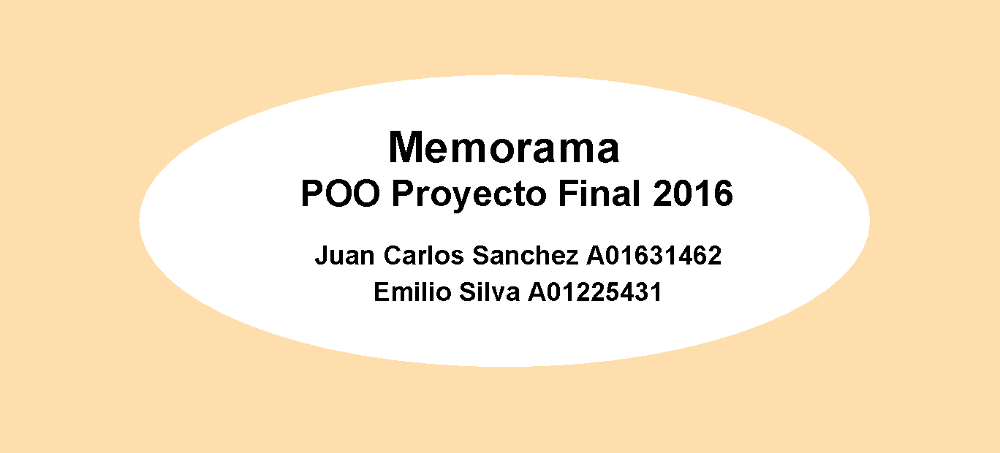

# Memorama POO - TC2016

## Acerca de
Este proyecto es un memorama educativo, que consta de 4 temas:
- Animales
- Colores
- Comida
- Paisajes

El programa está destinado a niños de entre 3 a 5 años y busca reforzar vocabulario del idioma inglés.

## Desarrollo
Esta hecho en Java utilizando la librería de GUI javax swing, y combina algunos de los temas vistos en clase.
